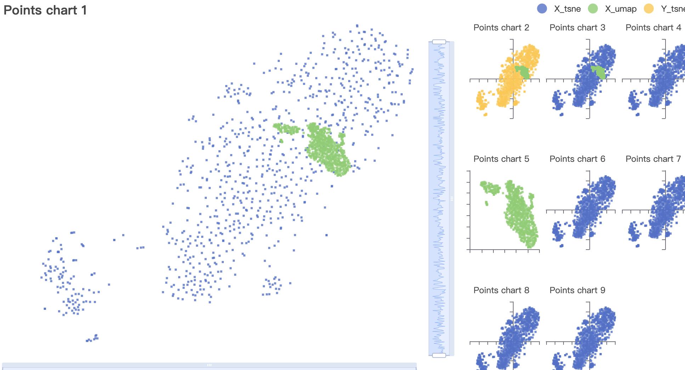

## 一、功能需求
左侧是主要图表，右侧是次要图表，点击右侧次要图表时，需要与左侧图表进行数据交换。

要注意的是所有的图表都是在一个 chart 容器内的，而不是每个图表单独的容器，因此本质上还是对数据的处理然后进行重新渲染。
 
### 主次图表

### 数据结构
```json
[
	// 1号散点图，两组散点
	{
		'X_tsne': [[111.111, 222.222],...],
		'X_umap': [[111.111, 222.222],...],
	},
	// 2号散点图，一组散点
	{
		'X_tsne': [[111.111, 222.222],...],
	},
	// 3号散点图，一组散点
	{
		'Y_tsne': [[111.111, 222.222],...],
	},
	// ...更多
]
```

## 二、实现思路
Echart 本身即可支持同一容器包含多个视图，而同一散点图的多组数据则是通过添加相同 xAxisIndex、yAxisIndex 的多条 series 数据实现，视图切换则是通过改变 grid 参数并重新渲染实现的。

## 三、核心代码
主次视图时，为图表添加点击事件，使得点击次要图表时实现与主要图表的数据交换。
```ts
// 添加点击事件
const handleClick = () => {
  chart.on('click', (params: any) => {
    handleData(params.seriesIndex)
  });
};
```
Echarts 自带的点击事件主要可以获取三个关键参数，seriesIndex、seriesId、seriesName，而我需要获取的是被点击的图表 index，来和 index = 0 也就是第一个图表进行数据交换。
### seriesIndex
要注意的是这三个参数获取的并不是被点击图表的配置，而是被点击的图表中具体到组的散点数据的配置，也就意味着如果一个图表中有两组散点数据的话，那么获取的 seriesIndex 和图表的 index 是无法匹配的。
### seriesId
seriesId 参数可以获取在配置项中手动为每组数据添加的 id，我尝试了为同一图表中的不同数据赋值图表的 index 作为 id，以便于点击事件获取，但是不支持重复的 seriesId，所以同一图表中的不同组散点数据无法使用一个 id。
### seriesName
seriesName 参数与 componentId 类似，并且可以重复，但是 seriesName 是作为名称要被展示在页面中的，因此也不能用来存储图表 index。

### seriesIndex 与数据进行匹配
最后使用的方案是用 seriesIndex 与数据进行匹配。

```ts
const handleData = (seriesIndex?: number) => {
  if (seriesIndex) {
	/**
     * dataArr：所有图表的数据数组
     * indexArr：用于判断被点击数据所属的图表 index
     * 假设有三个图表四组数据，1号图表有两组数据，2、3号图表各有一组数据
     * indexArr 为 [0, 0, 1, 2]
     */
    let indexArr: any = [];
    for (let i = 0; i < newDataArr.length; i++) {
      for (let j = 0; j < Object.keys(newDataArr[i]).length; j++) {
        indexArr.push(i)
      }
    }
	/**
     * 利用 indexArr[seriesIndex] 即可获取被点击的图表 index
     * 判断不为0时，即点击了次要图表，与主要图表进行数据交换
     */
    if (indexArr[seriesIndex]) { [dataArr[0], dataArr[indexArr[seriesIndex]]] = [dataArr[indexArr[seriesIndex]], dataArr[0]] };
  };
  // 继续下一步处理
  // 要注意最后重新 setOption 的时候，要带上第二个 true 参数
  // chart.setOption(option, true);
  initView();
}
```