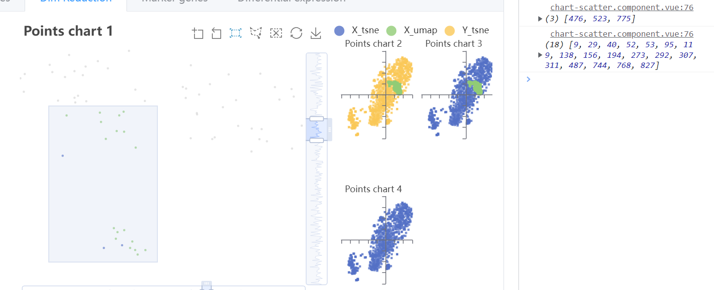
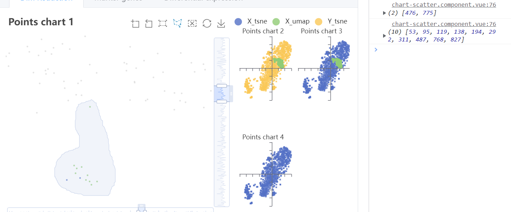

## 一、Bug
Echarts 官方提供的数据框选功能中，针对散点图可以添加 [brushselected](https://echarts.apache.org/zh/api.html#events.brushselected) 事件来获取被框选的点的索引值，但是当使用 large 参数来开启大数据量优化后，再进行框选时存储选中点索引集合的字段 dataIndex 返回的是空数组。

截止 5.3 版本该 bug 仍未解决，因此需要自行对散点图框选进行处理。

## 二、处理逻辑
所使用到的框选分为两种，矩形框选和不规则框选。

矩形框选较好实现，只需要获取框选的四个顶点的坐标然后找出在此范围内的点即可。

不规则框选则需要使用引射线法来对每个点进行判断，由于数据量比较大，如果遍历整个图表的所有点进行判断性能不是很优，因此可以找出不规则框选的极限横纵坐标，将其假想为矩形，优先筛选出矩形内的点，然后再用筛选后的点进一步按照引射线法进行判断。
## 三、效果展示
### 3.1 矩形框选
因为同一图表中有蓝绿两组数据，因此打印出来的是两组索引值，根据索引值就可以找出具体被框选的点。


### 3.2 不规则框选


## 四、代码实现
### 4.1 添加点击事件
```ts
// data 为数据集合格式如下
// [{ typeA: [[x0,y0], [x1,y1]...], typeB: [[x0,y0], [x1,y1]...] }]
chart.on('brushend', (params: any) => {
  let keys = Object.keys(data[0]);
  for (let i = 0; i < keys.length; i++) {
    console.log(onBrushend(params, data[0][keys[i]]));
  }
});
```
### 4.2 事件逻辑
```ts
/**
 * chart 自带的 brushend 事件调用该函数
 * @param params 
 * @param data 点数据集合
 * @returns 被选中的点索引值
 */
export const onBrushend = (params: any, data: number[][]) => {
  // 单击图表也会触发 brushend 事件，判断是否有 area
  if (!params.areas[0]) return;
  // 选中的点的索引集合
  let selectedList = [];
  /**
   * areas 中包含 range 和 coordRange
   * range：全局坐标系，以整个 canvas 区域来计算的，无法使用
   * coordRange：平面坐标系，以图表的横纵坐标进行计算，使用该参数，需要配置 brush 工具为平面坐标系
   * 格式为 [[x0,y0],[x1,y1]......]
   */
  let range = params.areas[0]?.coordRange;
  // 矩形框选
  if (params.areas[0]?.brushType === 'rect') {
    // 框选区域 x、y 坐标
    let rangeX = range[0];
    let rangeY = range[1];
    for (let i = 0; i < data.length; i++) {
      // 单点 x、y 坐标
      let x = data[i][0];
      let y = data[i][1];
      // 判断是否在框选区域内
      if ((rangeX[0] <= x && x <= rangeX[1]) && (rangeY[0] <= y && y <= rangeY[1])) {
        selectedList.push(i);
      }
    }
  } else if (params.areas[0]?.brushType === 'polygon') {
    /**
     * 不规则框选
     * coordRange 获取的是框选边框所有坐标点的集合
     * 首先找出不规则区域最大和最小的 x、y 轴坐标，模拟矩形框选，缩小区域节约计算
     * 然后矩形区域内的点进一步使用引射线法来判断是否在不规则框选区域内
     * 这里要注意使用 for 循环不使用 forEach 等来节省性能
     */
    // 将第一组 range 数据作为基础比较数据
    let minX = range[0][0];
    let maxX = range[0][0];
    let minY = range[0][1];
    let maxY = range[0][1];
    // 循环遍历 range 数组，求出不规则区域最大和最小的 x、y 轴坐标
    for (let i = 1; i < range.length; i++) {
      // 使用 if 不使用 Math，更好的性能
      if (range[i][0] > maxX) maxX = range[i][0];
      if (range[i][0] < minX) minX = range[i][0];
      if (range[i][1] > maxY) maxY = range[i][1];
      if (range[i][1] < minY) minY = range[i][1];
    }
    // 同上矩形框选的判断方法先筛选出矩形内的点
    let arr = []
    for (let i = 0; i < data.length; i++) {
      let x = data[i][0];
      let y = data[i][1];
      if ((minX <= x && x <= maxX) && (minY <= y && y <= maxY)) {
        // arr 为矩形内点的索引的集合
        arr.push(i);
      }
    }
    // 遍历矩形内所有的点，用引射线法判断是否在框选区域内
    for (let i = 0; i < arr.length; i++) {
      let point = data[arr[i]];
      pointInPolygon(point, range) && selectedList.push(arr[i])
    }
  }
  return selectedList;
}

/**
 * 引射线法：从目标点出发引一条射线，看这条射线和多边形所有边的交点数目。
 * 如果有奇数个交点，则说明在内部，如果有偶数个交点，则说明在外部。
 * @param point [x,y] ,待判定的点坐标
 * @param polygon [[x0,y0],[x1,y1]......] 多边形的路径
 * @returns true or false
 */
export const pointInPolygon = (point: number[], polygon: number[][]) => {
  // px，py为p点的x和y坐标
  let px = point[0],
    py = point[1],
    flag = false
  //这个for循环是为了遍历多边形的每一个线段
  for (let i = 0, l = polygon.length, j = l - 1; i < l; j = i, i++) {
    let sx = polygon[i][0],  //线段起点x坐标
      sy = polygon[i][1],  //线段起点y坐标
      tx = polygon[j][0],  //线段终点x坐标
      ty = polygon[j][1]   //线段终点y坐标

    // 点与多边形顶点重合
    if ((sx === px && sy === py) || (tx === px && ty === py)) return true;
    // 点的射线和多边形的一条边重合，并且点在边上
    if ((sy === ty && sy === py) && ((sx > px && tx < px) || (sx < px && tx > px))) return true;
    // 判断线段两端点是否在射线两侧
    if ((sy < py && ty >= py) || (sy >= py && ty < py)) {
      // 求射线和线段的交点x坐标，交点y坐标当然是py
      let x = sx + (py - sy) * (tx - sx) / (ty - sy)
      // 点在多边形的边上
      if (x === px) return true;
      // x大于px来保证射线是朝右的，往一个方向射，假如射线穿过多边形的边界，flag取反一下
      if (x > px) flag = !flag;
    }
  }
  // 射线穿过多边形边界的次数为奇数时点在多边形内
  return flag;
}
```

>[射线法判断一个点是否在多边形内部（js版）](https://blog.csdn.net/qq_23447231/article/details/121920282)