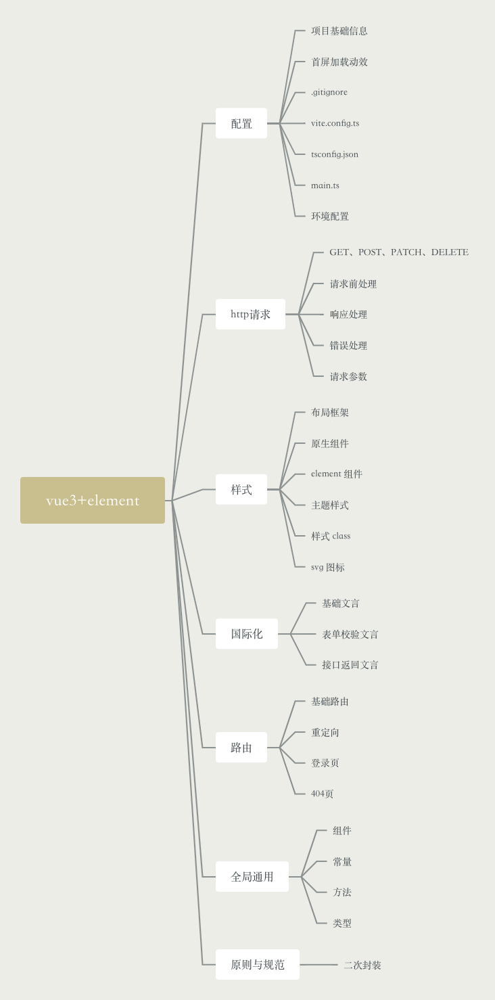

## 一、框架搭建

>基础框架git地址：https://github.com/mabowen1995/vue3-element-admin

往往从0到1开发项目时发觉无从下手，或者很可能一步一个坑，因为大多基础框架公司已经搭建完毕的，新加入的成员也都是在此基础上进行功能模块的拓展。网上也鲜有详尽的全流程参考，多是某个局部功能的搭建，因此整理了一份包含以下方面的前端基础框架全流程搭建要义。



## 二、构建与安装

### 构建项目

``` sh
# 执行 vite3 构建命令
yarn create vite
```

依次输入项目名称，选择 vue、typescript 进行构建，此时一个 vue3 项目就构建完成了。

``` json
// 版本信息
"vite": "^3.2.3",
"vue": "^3.2.41"
```

### 安装常用库

项目创建好后需要安装一些项目需要的库，包含一些必备的库和一些被广泛使用的工具库，安装库的原则是评估一下现有需求和未来可能会出现的需求，是否会经常使用到该库，假设说这是一个一次性交付的项目，项目中可能从始至终只使用到这个库的一个方法，那么这种情况下就不必引入该库，自己封装即可。

评估需求后一个常用的后台管理系统必备以下的库：

``` sh
# 路由
yarn add vue-router@4
# 状态管理
yarn add pinia
# 组件库
yarn add element-plus
# 网络请求
yarn add axios
```

以下的库则可以按需引入：

``` sh
# 使用 less 或 scss 均可简化样式方面的开发，自行选择顺手的即可
yarn add less
yarn add less-loader
# 如果需要在前端对数据进行一些复杂操作，loadsh 也是必不可少的存在
yarn add loadsh
# qs 库是一个用来序列化 post 请求中的 body 参数的库
yarn add qs
# day.js 是用来处理时间格式的库，相比 moment.js 更加的轻量
yarn add dayjs
# 如果项目有国际化需求的话需要引入 vue 官方提供的解决方案 vue-i18n
yarn add vue-i18n
# 图表库，不考虑数据量级的话，该库算是非常新手友好了
yarn add echart
# 代码规范的库，好的规范可以让代码有更持久的生命力
yarn add eslint
# 支持 svg 图标的库
yarn add vite-plugin-svg-icons -D
yarn add fast-glob -D
```

目前项目中需要使用到的一些常用的库都已经安装完毕，可以先提交一版 git，养成小步迭代的好习惯。

安装完毕后需要修改一些文件来规范项目信息和适配各个库，包含但不限于以下文件：
- package.json 里的项目名称和版本
- index.html 的网站标题和图标、首屏加载动效
- .gitignore 里是否需要添加一些匹配的文件来阻止上传至 git
- vite.config.ts 配置一些规则，比如绝对路径别名、svg 支持等
- tsconfig.json 配置绝对路径规则
- main.ts 导入全局使用的库
- 创建环境文件 .env

然后将修改好的代码提交至 git 库，到此准备工作就完成了。

## 三、基础框架结构

### 文件结构
``` json
src
|- api
   |- interceptors     // 接口请求封装
|- assets              // 图片等静态资源
   |- svg              // svg 文件
|- components          // 全局组件
|- consts              // 定义一些全局常量
|- locales             // 国际化文件
|- models              // 类型定义文件
|- router              // 路由文件
|- store               // 状态管理文件
|- styles              // 样式文件
   |- theme.less       // element 主题及组件样式修改
   |- variables.less   // 常用样式封装成 class
|- utils               // 通用工具封装
|- views               // 页面文件
   |- components       // 业务组件
```

### 接口请求相关文件 /api

首先是对接口请求的拦截逻辑，需要先思考接口请求前需要做什么，接口请求后需要对结果有什么处理，然后哪些参数是所有接口通用的，大致需求如下：

- 请求前需要先检查 token 是否存在，而哪些是像登录接口这样不需要 token 的
- 请求后需要针对 401、500 等无法返回正确结果的状态码进行处理
- 请求的前缀和超时时间是通用的，不需要每次请求都配置一遍

因此 /src/api/interceptors 文件夹中需创建五个文件：

- cancel.ts
- errors.ts
- index.ts
- request.ts
- response.ts
- http.ts

``` ts
// 首先看 http.ts
export const http = axios.create({
  baseURL: import.meta.env.VITE_APP_BASE_API + '/api/v1',
  withCredentials: true,
  timeout: 60000,
});
http.interceptors.request.use(requestHandler, errorHandler);
http.interceptors.response.use(responseHandler, errorHandler);
```

http.ts 文件是对 axios 请求的封装，定义接口的通用前缀同时加入拦截器。

request.ts 文件的 requestHandler 方法来判断本地存储是否有 token，来选择跳到登录页还是继续发起请求。

response.ts 文件的 responseHandler 方法则是对响应进行处理，一般是用来存储接口在响应头中携带的 token。

errors.ts 文件的 errorHandler 方法则是对错误状态码进行处理，如果 401 则清除本地 token 并跳转到登录页，如果是其他错误类型则使用 element 的 message 组件弹出接口返回的错误信息。

cancel.ts 文件较为特殊，是针对接口竞态处理的文件，需要看业务是否有需要，如果请求还没完成，重复请求该接口会取消上一个请求，防止接口重复请求时由于新请求响应早于旧请求而导致旧的结果覆盖新的结果。

index.ts 文件用于导出该文件夹下的所有文件，建议每个封装通用内容的文件夹下都使用这个进行导出，这样的话其他模块引入的路径就不需要精确到具体文件，而是精确到该文件夹。好处是如果对某个文件改名，不需要查找整个项目来看哪些地方引入了该文件，只需要在 index.ts 中修改即可。

### 静态资源文件 /assets/svg

svg 文件常用来作为 icon 使用，单独说一下 svg。如果当业务需求较为简单时，element 提供的官方图标完全能够满足需求，不需要单独再设计一组图标，而当 element 图标库不满足需求时，则应该建议 UI 设计提供 svg 格式的图标，相比 png 格式有以下优点：

- svg 图标体积更小
- svg 不会出现图片无法加载时的裂开效果
- svg 更适配 element 方案
- svg 是矢量图，无限放大也不会模糊

除此之外也可以引入第三方图标库如 Font Awesome。

### 组件 /components

components 文件夹有两个，一个是 /src/components，另一个是 /src/views/components，其中第一个是用来存放通用组件的，比如用来显示 svg 的 svg-icon.vue。而业务开发中所需要的业务组件，无法给全局使用的建议放到 views 文件夹下的 components 中。

### 全局常量 /const

存放一些全局通用的常量，比如任务状态等。

``` ts
export const TaskStatusMap = {
    1: "waiting",
    2: "running",
    3: "completed",
    4: "pause",
    5: "cancel",
    6: "error"
}
```

### 国际化文件 /locales

较为简单参考 vue-i18n 的文档即可，不过要注意的是表单校验的文言就需要单独封装一个方法来进行配置了。而还有一种前端国际化覆盖不到的就是后台接口返回的文言，这种文言解决方案建议是处理请求头，请求头中可以携带国际化信息，后台根据请求头来返回文言，而不是通过前端 body 传参的方式。

>[参考文档](http://www.ppdouble.com/blogs/development/Vue3%20+%20ts%20+%20ElementUI%20+%20vue-i18n%20%E5%9B%BD%E9%99%85%E5%8C%96.html)

### 类型文件 /models

用于规范类型，也是为了规范而存在的。

``` ts
// 后台返回的分页数据类型
export interface MetaModel {
    pageNo: number;
    pageSize: number;
    total: number;
}
```

### 路由 /router

路由方面官方文档也比较健全，唯一需要注意的地方就是可以添加一个匹配规则，当用户输入的路由不存在时默认跳转到首页或者错误页，而不是给用户一个报错。

```ts
{
   path: "/:pathMatch(.*)*",
   redirect: { name: "Home" },
}
```

### 状态管理 /store

使用了新一代状态管理 pinia，官方有文档，略。

>[参考文档](http://www.ppdouble.com/blogs/development/Vue%20%E6%96%B0%E7%8A%B6%E6%80%81%E7%AE%A1%E7%90%86%E5%B7%A5%E5%85%B7%20Pinia%20%E5%88%9D%E6%8E%A2.html)

### 样式文件 /styles

样式文件主要有两个，一个是 theme.less，这个文件用来适配项目主题，一些通用样式的修改都在这里，比如主题色、element 组件样式，原生组件比如单选框、a标签的样式等。

另一个是 variables.less，这个文件主要定义一些通用变量和用来封装一些样式 class。比如文字超出时显示...的效果，就可以定义成一个 class，这样全局使用的时候不需要每个页面复写一遍样式，直接加个 class 即可。

以前做的很多项目，拿到设计图之后由于每个人负责不同的页面，都在各自的页面里去修改样式。但是设计往往是有一个固定的规范的，比如按钮这种组件整个系统应该是一致的，这种时候就需要在 theme.less 中对组件库的按钮样式进行更改，而不是在每个页面中都去修改一遍按钮样式。而且要依照组件库文档进行修改而不是去改 background-color 这些基础 css，因为组件库的一个组件可能包含多种动效比如 hover、disabled、click 等是静态设计图体现不出来的，直接用基础 css 样式修改可能会覆盖掉原本的动效。

``` less
// element 官方建议的其中一种修改主题的方式
:root {
    --el-color-primary: rgba(95, 1, 133, 1);
    --el-color-primary-light-1: rgba(95, 1, 133, 0.9);
    --el-color-primary-light-2: rgba(95, 1, 133, 0.8);
    --el-color-primary-light-3: rgba(95, 1, 133, 0.7);
    --el-color-primary-light-4: rgba(95, 1, 133, 0.6);
    --el-color-primary-light-5: rgba(95, 1, 133, 0.5);
    --el-color-primary-light-6: rgba(95, 1, 133, 0.4);
    --el-color-primary-light-7: rgba(95, 1, 133, 0.3);
    --el-color-primary-light-8: rgba(95, 1, 133, 0.2);
    --el-color-primary-light-9: rgba(95, 1, 133, 0.1);
}
```

### 工具方法 /utils

放一些全局方法，比如对数字加逗号的处理、监听 localstorage 存储等。

## 三、一些额外问题

### 二次封装

这套前端基础框架没有对组件库二次封装，而选择直接使用官方组件库。

很多论坛有帖子是对组件库的二次封装，前司甚至自己写了一套 angular 组件库出来，而这是否有必要论坛里对此也是褒贬不一，需要衡量一下二次封装的成本。

一是二次封装的维护成本，二是新人上手的开发成本，进行二次封装后的组件很难有官方组件库那样详尽的文档，同时也需要开发者长期的进行维护与迭代，这样必然会造成资源的占用。而新人的上手成本也需要考量，花多长的学习时间才能熟练运用也是需要进行评估的，目前大部分二次封装的组件因为没有文档的辅助无法做到开箱即用。

而官方组件库经过多年的持续打磨与迭代，很多优秀工程师的共同努力，已经是一个相对来说较为平衡的版本，足够满足大多数功能而又维持必要的可拓展性。因此如果项目每个页面都是较为定制化，那么使用官方组件库即可。如果公司项目以外包为主或者重复性高比如每个页面都是xx管理这种一套增删改查类表格的话，可以根据业务对组件库进行二次封装。