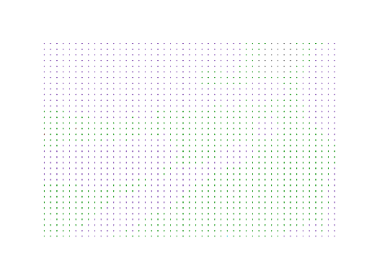

## 一、需求

plotly 可视化散点图默认会将散点自动填充至整个画布区域，这样就会导致散点图形变。这种形变是两方面带来的，一方面是自动选取最大和最小的xy轴坐标作为范围，可以想象成将一个长方形的图片塞入一个正方形的容器中，并且还需要全部显示出来，那么图片的长度就会被压缩；另一方面是画布区域的长宽比不固定而导致的形变，画布区域的长宽会根据显示器来自适应。

## 二、实现

想要可视化散点图恢复至原有的比例，即坐标相差1的时候，x轴和y轴各自点与点之间的距离应该是相同的，效果如下图所示。


### 数据导致的形变

首先解决画布区域内散点自动填满x轴和y轴导致的形变问题，也就是单纯针对数据进行比例的计算。

``` ts
export const autoChangeScale = (dataset: any) => {
  // 第一步：遍历整个数组找出x轴坐标和y轴坐标各自的最大最小值
  // 这里使用 for 循环不使用 Math 方法，因为数据量大时 for 循环速度更快
  let minX = dataset.cell_x[0];
  let maxX = dataset.cell_x[0];
  let minY = dataset.cell_y[0];
  let maxY = dataset.cell_y[0];
  for (let i = 0; i < dataset.cell_x.length; i++) {
    if (dataset.cell_x[i] > maxX) maxX = dataset.cell_x[i];
    if (dataset.cell_x[i] < minX) minX = dataset.cell_x[i];
  }
  for (let i = 0; i < dataset.cell_y.length; i++) {
    if (dataset.cell_y[i] > maxY) maxY = dataset.cell_y[i];
    if (dataset.cell_y[i] < minY) minY = dataset.cell_y[i];
  }
  let rangeX = [minX, maxX];
  let rangeY = [minY, maxY];
  // 第二步：判断x轴与y轴哪个范围更小，范围小的说明是需要进行处理的轴
  let newRangeX = [0, 0];
  let newRangeY = [0, 0];

  // 第三步：计算出形变的比例
  if ((rangeX[1] - rangeX[0]) > (rangeY[1] - rangeY[0])) {
    // 如果y轴的数据范围较小，说明y轴被默认拉伸了，那么就应该扩充y轴的坐标轴范围来恢复y轴原本的比例
    let num = ((rangeX[1] - rangeX[0]) / (rangeY[1] - rangeY[0])) // 形变的倍数
    let num2 = (rangeY[1] - rangeY[0]) * (num - 1) / 2            // 倍数除2计算出两边各自应该加减的值
    newRangeY[0] = Math.round(rangeY[0] - num2)
    newRangeY[1] = Math.round(rangeY[1] + num2)
    newRangeX = rangeX
  } else {
    // x轴同理
    let num = (rangeY[1] - rangeY[0]) / (rangeX[1] - rangeX[0]) // 倍数
    let num2 = (rangeX[1] - rangeX[0]) * (num - 1) / 2
    newRangeX[0] = Math.round(rangeX[0] - num2)
    newRangeX[1] = Math.round(rangeX[1] + num2)
    newRangeY = rangeY
  }

  return [newRangeX, newRangeY]
}
```

### 容器导致的形变

画布区域内的数据范围导致的形变已经解决了，还需要解决画布区域本身的形变问题，由于是自适应显示器宽高，因此需要将画布区域的 dom 元素作为参数传进来。

``` ts
export const autoChangeScale = (refDom: HTMLElement) => {
  // 判断 dom 元素是否存在
  if (!refDom) return;
  // 预设默认比例为 1
  let divScale = 1;
  // 计算宽高比
  divScale = refDom!.clientWidth / refDom!.clientHeight
  if (divScale < 1) {
    // 宽高比如果小于 1，则调节高的范围
    let num = (newRangeY[1] - newRangeY[0]) * (1 - divScale) / 2
    newRangeY[0] = Math.round(newRangeY[0] - num)
    newRangeY[1] = Math.round(newRangeY[1] + num)
  } else {
    // 宽高比大于 1 同理
    let num = (newRangeX[1] - newRangeX[0]) * (divScale - 1) / 2
    newRangeX[0] = Math.round(newRangeX[0] - num)
    newRangeX[1] = Math.round(newRangeX[1] + num)
  }

  return [newRangeX, newRangeY]
}
```

最后将两个方法进行合并即可，就可以取得不会形变但又能自适应显示器的可视化散点图。