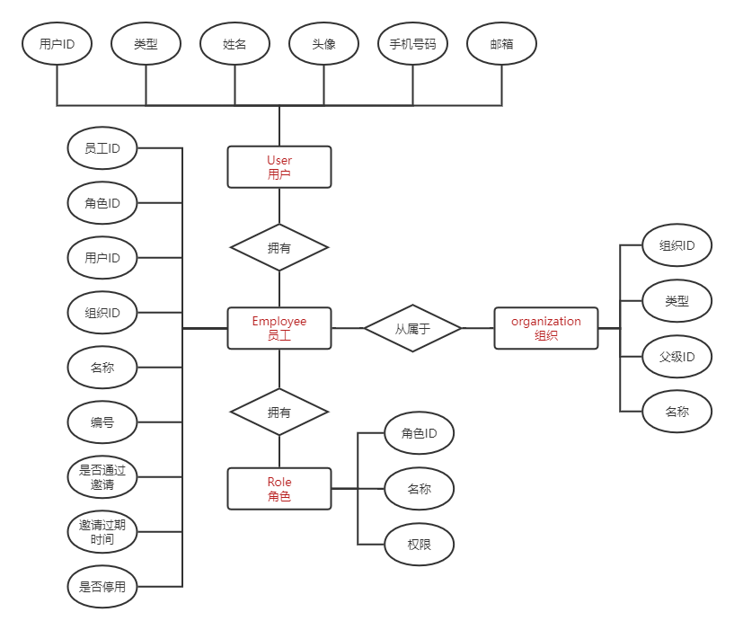
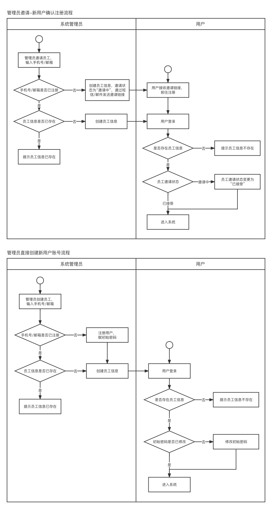

整理了一下 toB 多组织系统中常见的实体关系，往往在实际项目中这些基础模块是公司老前辈已经开发完成的，因此新人在此基础上开发一些相关的业务模块很容易被这些模糊不清的关系搞晕。

## 一、定义

### user
用户，操作者的唯一标识，通常使用手机、邮箱作为注册账号，作为登录的凭证使用。
### organization
组织，组织不一定是企业，也可以是临时构成的项目组，组织的建立便于进行独立业务的相关开展。一般来说企业为根组织，管理员可以在根组织基础上建立子组织。

### employee
员工，用户在不同组织内的员工身份，用户在一个组织中只有一个员工身份，用户在不同组织中可以有多个员工身份，使得用户在不同组织中的操作保持各自独立的状态。
### role 
角色，员工在当前组织中所扮演的角色。比如用户张三在组织A中是项目经理，在组织B中可以是技术开发，这取决于用户在不同组织中的具体分工。这种情景往往适合一些独立事业部架构或者临时成立的项目组，从原有组织架构中不同的部门抽调部分人员来组成一个临时的项目组，并重新赋予各自新的角色。

## 二、设计

## 三、流程
项目的初始会有一个根组织与超级管理员账号以供使用，根组织可以是一个整体管理的组织，不参与实际的项目，超级管理员也是用来进行组织的维护使用，而实际的业务则需要创建子组织和子组织的管理员。

因此超级管理员创建一个组织【医疗事业部】，在该组织内创建角色【事业部管理员】，有个组织和角色还需要一个所属这个角色的员工【张三】，可以通过下图的流程完成用户【张三】的创建。

**用户【张三】，在组织【医疗事业部】以员工【张三】的身份中担任【事业部管理员】**，后续的人员操作都可以让【张三】使用该流程来进行邀请。

## 四、一些问题
### Q：为什么不只用一个 user 实体，一定要创建一个 employee 实体？

A：现实场景中一个用户可能在不同组织中担任不同的身份，而角色只是用来设定岗位权限的，那如果这个用户在不同的组织中连工号和名称都不同的时候该怎么办，所以仅靠用户和角色两个实体不足以满足需求，因此需要额外一个实体来确定用户和组织的关系。

### Q：role 和 employee 又是什么关系？

A：一个员工可以有不同的角色，身兼数职，权限自然更宽泛，系统中也会先获取员工的角色列表，把这些角色的所有权限做合集，最后用这个权限的合集来进行下一步判断。

### Q：user 和 employee 之间有直接关联么？

A：员工必须是属于某个组织的，因此用户和员工之间必须有组织的联系。